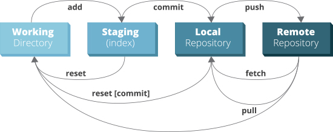

# Git Cheatsheet

## Links und Bücher

[Git Community Book](https://book.git-scm.com/)

[git - Der einfache Einstieg](https://rogerdudler.github.io/git-guide/index.de.html)

## git installieren

[Git für OSX](http://git-scm.com/download/mac)

[Git für Win](http://msysgit.github.io/)

[Git für Linux](http://book.git-scm.com/2_installing_git.html)

### git workflow



## git befehle

```bash
# git konfigurieren
git config --global user.email "email@mii.com"
git config --global user.name "My Name"

# neues repository erstellen
git init

# ein repository auschecken
git clone https://github.com/darkop/git-cheatsheet.git

# add & commit
git status                                    # status abfragen
git add <dateiname>
git add .
git commit -am "Commit-Nachricht"

# änderungen hochladen
git remote -v                                 # remote branch prüfen
git remote add origin <server>                # mit remote branch verbinden, wenn nicht geklont
git push origin master                        # entfernte repo updaten

# branching
git checkout -b feature_x                     # branch anlegen und wechseln
git checkout -b feature_x feature_y           # branch basiert auf
git checkout master                           # zu master wechseln
git push -u origin feature_x                  # branch remote anlegen
git push origin feature_x                     # remote branch updaten
git branch -d feature_x                       # branch löschen
git push origin :feature_x                    # remote branch löschen

# update & merge
git pull                                      # fatch and merge
git merge <branch>                            # branches zusammenführen
git add <dateiname>                           # nach dem konflikt
git diff <quell_branch> <ziel_branch>         # vor dem merge Differenzen anschauen

# tagging
git tag 1.0.0 1b2e1d63ff                      # Releasestags anlegen
git log                                       # die Liste der Commit-IDs

# änderungen rückgängig machen
git checkout -- <filename>                    # Datei zum letzten Stand im HEAD zurücksetzen
git checkout -- .                             # alle änderungen verwergen
# lokalen Änderungen komplett entfernen
git fetch origin
git reset --hard origin/master

# nützliche tricks

git rm --cached /path/to/file                 # entferne Datei aus dem git ohne es zu löschen, in .gitignore eintragen
git log --graph --oneline --all               # Git tree in terminal
gitk                                          # Eingebaute git-GUI
git config color.ui true                      # Farbige Konsolenausgabe:
git config format.pretty oneline              # Einezeilige Commit Logausgabe
git add -i                                    # Interaktives Hinzufügen von Änderungen
git merge v1.0 --no-commit --no-ff            # merge ohne auto commit
```

### .gitignore

Link zu dem [.gitignore](https://github.com/github/gitignore) Dateien für unterschiedliche Projekte.

### .gitconfig

Ein Bsp. für [gitconfig](https://gist.github.com/pksunkara/988716) Datei

## gitflow

### Links

[A successful Git branching model](http://nvie.com/posts/a-successful-git-branching-model/)

[git-flow Spickzettel](https://danielkummer.github.io/git-flow-cheatsheet/index.de_DE.html)

[Gitflow Workflow](https://www.atlassian.com/git/tutorials/comparing-workflows/gitflow-workflow)

[Git Flow Workflow 2](https://leanpub.com/git-flow/read)

[Git-Workflows - Der Gitflow-Workflow](https://infos.seibert-media.net/display/Productivity/Git-Workflows+-+Der+Gitflow-Workflow)

[Using git-flow to automate your git branching workflow](https://jeffkreeftmeijer.com/git-flow/)

[Guide to using GitFlow](https://blogs.endjin.com/2013/04/a-step-by-step-guide-to-using-gitflow-with-teamcity-part-3-gitflow-commands/)


### git-flow installieren

[Mac OS X](https://github.com/nvie/gitflow/wiki/Mac-OS-X)

[Linux](https://github.com/nvie/gitflow/wiki/Linux)

[Windows](https://github.com/nvie/gitflow/wiki/Windows)

### Initializieren

gitflow | git
--------|-----
`git flow init` | `git init`
&nbsp; | `git commit --allow-empty -m "Initial commit"`
&nbsp; | `git checkout -b develop master`

### Mit entfernter repo verbinden

gitflow | git
--------|-----
_N/A_ | `git remote add origin <server>`

### Features

#### feature branch erstellen

gitflow | git
--------|-----
`git flow feature start MYFEATURE` | `git checkout -b feature/MYFEATURE develop`

#### feature branch hochladen

gitflow | git
--------|-----
`git flow feature publish MYFEATURE` | `git checkout feature/MYFEATURE`
&nbsp; | `git push origin feature/MYFEATURE`

#### lokale feature branch aktuallisieren

gitflow | git
--------|-----
`git flow feature pull origin MYFEATURE` | `git checkout feature/MYFEATURE`
&nbsp; | `git pull --rebase origin feature/MYFEATURE`

#### feature branch abschliessen

gitflow | git
--------|-----
`git flow feature finish MYFEATURE` | `git checkout develop`
&nbsp; | `git merge --no-ff feature/MYFEATURE`
&nbsp; | `git branch -d feature/MYFEATURE`

#### Push und merged feature branch

gitflow | git
--------|-----
_N/A_ | `git push origin develop`
&nbsp; | `git push origin :feature/MYFEATURE` _(if pushed)_

### Releases

#### release branch erstellen

gitflow | git
--------|-----
`git flow release start 1.2.0` | `git checkout -b release/1.2.0 develop`

#### release branch hochladen

gitflow | git
--------|-----
`git flow release publish 1.2.0` | `git checkout release/1.2.0`
&nbsp; | `git push origin release/1.2.0`

#### lokale release branch aktuallisiere

gitflow | git
--------|-----
_N/A_ | `git checkout release/1.2.0`
&nbsp; | `git pull --rebase origin release/1.2.0`

#### release branch abschliessen

gitflow | git
--------|-----
`git flow release finish 1.2.0` | `git checkout master`
&nbsp; | `git merge --no-ff release/1.2.0`
&nbsp; | `git tag -a 1.2.0`
&nbsp; | `git checkout develop`
&nbsp; | `git merge --no-ff release/1.2.0`
&nbsp; | `git branch -d release/1.2.0`

#### Push merged feature branch

gitflow | git
--------|-----
_N/A_ | `git push origin master`
&nbsp; | `git push origin develop`
&nbsp; | `git push origin --tags`
&nbsp; | `git push origin :release/1.2.0` _(if pushed)_

### Hotfixes

#### hotfix branch erstellen

gitflow | git
--------|-----
`git flow hotfix start 1.2.1 [commit]` | `git checkout -b hotfix/1.2.1 [commit]`

#### hotfix branch abschliessen

gitflow | git
--------|-----
`git flow hotfix finish 1.2.1` | `git checkout master`
&nbsp; | `git merge --no-ff hotfix/1.2.1`
&nbsp; | `git tag -a 1.2.1`
&nbsp; | `git checkout develop`
&nbsp; | `git merge --no-ff hotfix/1.2.1`
&nbsp; | `git branch -d hotfix/1.2.1`

#### Push merged hotfix branch

gitflow | git
--------|-----
_N/A_ | `git push origin master`
&nbsp; | `git push origin develop`
&nbsp; | `git push origin --tags`
&nbsp; | `git push origin :hotfix/1.2.1` _(if pushed)_

### Sources


## Git-flow Example

```bash
git flow init

# feature
git flow feature start first_feature
git flow feature publish first_feature            # feature veröffentlichen
git flow feature pull origin first_feature        # feature holen
git add .
git commit -am "add my first feature"
git flow feature finish first_feature
git push origin develop

# release
git flow release start 0.2.0
git flow release publish 0.2.0                    # release veröffentlichen
git flow release track 0.2.0                      # remote release verfolgen
git flow release finish 0.2.0                     # merge nach master und develop
git push origin develop                           # develop remote update
git checout master                                # nach master vechselen
git push origin master                            # master remote update
git push --tags                                   # tag veröffentlichen

# horfix
git flow hotfix start hotfix_branch
git flow hotfix finish hotfix_branch
```

### Befehle

